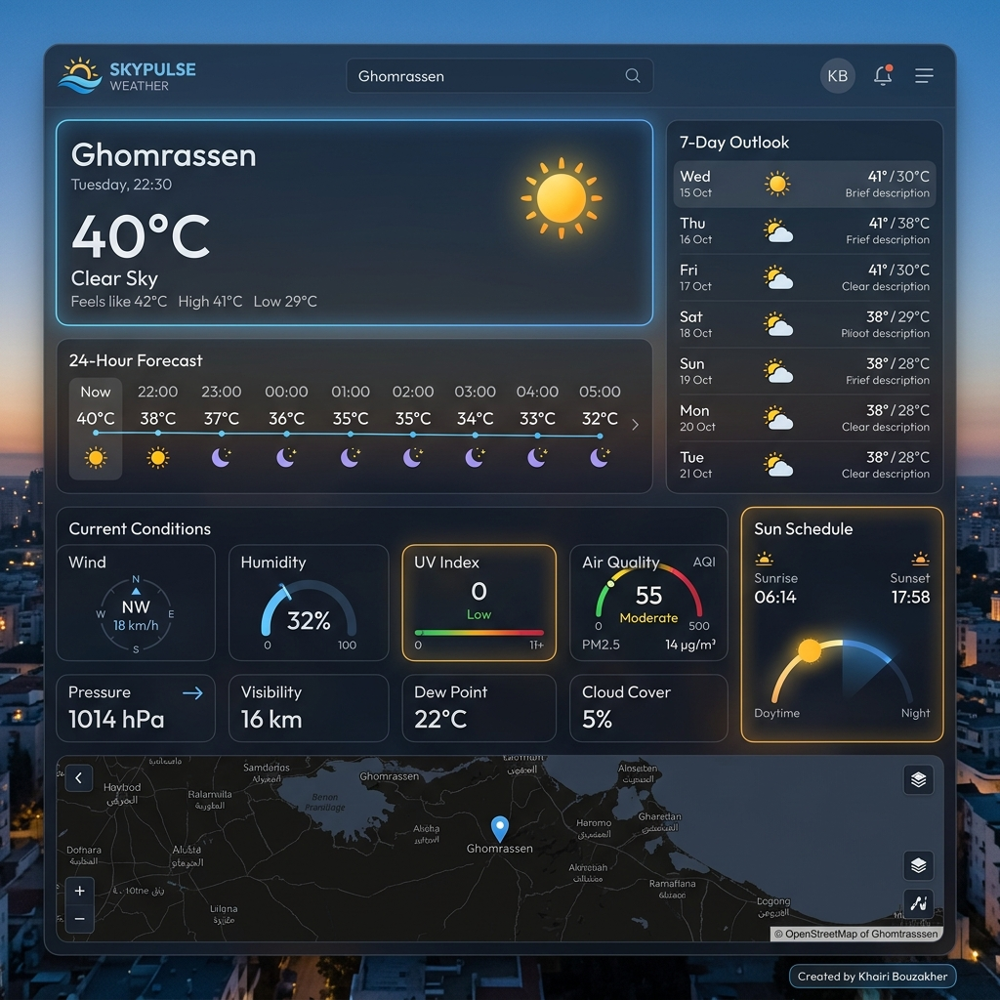

<h1 align="center">
  <br>
  🌤️ SkyPulse Weather
  <br>
</h1>

<h3 align="center">
  Live Weather &amp; Air Quality Intelligence
</h3>

<p align="center">
  <a href="https://github.com/KHAIRIBO/Live-Weather-Intelligence">
    
  </a>
  <a href="https://github.com/KHAIRIBO/Live-Weather-Intelligence">
    
  </a>
  <a href="https://github.com/KHAIRIBO/Live-Weather-Intelligence">
    
  </a>
  <a href="https://open-meteo.com/">
    
  </a>
  <a href="https://github.com/KHAIRIBO/Live-Weather-Intelligence/blob/main/LICENSE">
    
  </a>
</p>

<p align="center">
  <a href="https://liveweatherai.netlify.app/" target="_blank">
    <strong>🌐 Open Live Web Application: https://liveweatherai.netlify.app/</strong>
  </a>
</p>

<p align="center">
  
</p>

<p align="center">
  A state-of-the-art real-time weather dashboard with city search, interactive forecasts, air quality tracking, and ambient weather animations.
</p>

---

## ✨ Features

### 🔍 Smart City Search
- **Real-time autocomplete** powered by Open-Meteo Geocoding API for cities worldwide
- **Popular cities** quick-select bar (Tokyo, New York, London, Paris, Sydney)
- **Search history** persisted in `localStorage`
- **"Near Me"** button using browser Geolocation API with reverse geocoding

### 🌡️ Current Weather Hero
- Giant temperature display with **°C / °F live unit toggle**
- Dynamic **animated weather icons** with glowing neon shadows
- "Feels Like" temperature, daily **High / Low**, weather condition badge & precipitation

### ⏱️ 24-Hour Forecast
- Scrollable **hourly timeline** showing temperatures, weather icons, and rain probability
- **Click any hour card** → opens detailed snapshot modal with humidity, wind & precipitation stats

### 📅 7-Day Weekly Outlook
- Full **7-day forecast cards** with weather icons, condition labels, rain chance
- Visual **temperature min-max spectrum bar** for each day
- **Click any day row** → opens a detailed daily breakdown modal

### 📊 Detailed Metrics Grid (All Clickable)
| Widget | Details |
|---|---|
| 🌬️ **Wind & Gust Compass** | Speed (km/h), gust speed & rotating compass dial |
| 💧 **Relative Humidity** | % gauge bar, dew point, comfort level |
| ☀️ **UV Index Scale** | Color-coded safety level from Low to Extreme |
| 🍃 **Air Quality (AQI)** | US AQI rating, PM2.5, PM10, NO2, O3 pollutant breakdown |
| 🧭 **Pressure & Visibility** | Barometric pressure (hPa) & visibility (km) |
| 🌅 **Sun Schedule** | Astronomical sunrise & sunset tracking |

### 🗺️ Interactive City Map
- **OpenStreetMap** embedded frame pinned at exact city coordinates
- Pulsing **weather station marker** at the selected location
- Direct **"Open Maps"** button for full browser map view

### 🎨 Glassmorphic Design
- Ultra-modern **dark glassmorphism** card system (`backdrop-blur-2xl`, translucent borders)
- **HTML5 Canvas** ambient particle animations that match the weather:
  - 🌧️ Rain drops for rainy/thunderstorm conditions
  - ❄️ Snowflakes for snowy weather
  - ⭐ Twinkling stars for clear nights
  - ☀️ Sunbeams for clear days
  - 🌫️ Floating clouds for cloudy/foggy conditions
- **Micro-animations** and hover effects throughout

---

## 🚀 Quick Start

### Prerequisites
- **Node.js** v18+
- **npm** v9+

### Installation

```bash
# Clone the repository
git clone https://github.com/KHAIRIBO/Live-Weather-Intelligence.git

# Navigate to project directory
cd Live-Weather-Intelligence

# Install dependencies
npm install

# Start development server
npm run dev
```

Open your browser at **https://liveweatherai.netlify.app/** 🎉

### Build for Production

```bash
npm run build
npm run start
```

> **Note**: If you are on Windows and encounter a Turbopack error due to policy restrictions, use the fallback webpack mode: `npm run build` already uses `--webpack` flag as a default.

---

## 🛠️ Tech Stack

| Technology | Purpose |
|---|---|
| **Next.js 16** (App Router) | React framework with SSR/SSG support |
| **TypeScript 5** | Full type safety across all components |
| **Tailwind CSS 4** | Utility-first styling with custom animations |
| **Lucide React** | SVG icon library |
| **Open-Meteo Geocoding API** | Real-time city search & coordinates |
| **Open-Meteo Weather API** | Current weather, 24h & 7-day forecast |
| **Open-Meteo Air Quality API** | Real-time US AQI & pollutant data |
| **OpenStreetMap** | Interactive city map embed |
| **HTML5 Canvas API** | Ambient weather particle animations |
| **Web Geolocation API** | Browser-based location detection |

---

## 📁 Project Structure

```
src/
├── app/
│   ├── globals.css         # Design tokens, animations, scrollbar styles
│   ├── layout.tsx          # Root layout with Outfit/Inter fonts & SEO metadata
│   └── page.tsx            # Main dashboard page (state management + layout)
├── components/
│   ├── Navbar.tsx          # Header with branding, city bar & unit toggle
│   ├── SearchBar.tsx       # Autocomplete city search with history
│   ├── WeatherHero.tsx     # Current weather hero card
│   ├── HourlyForecast.tsx  # 24-hour scrollable timeline (clickable)
│   ├── DailyForecast.tsx   # 7-day outlook (clickable rows)
│   ├── MetricsGrid.tsx     # All 6 weather metric cards (clickable)
│   ├── MetricDetailModal.tsx # Detail modals for all metric types
│   ├── CityMap.tsx         # Interactive OpenStreetMap embed
│   ├── WeatherCanvas.tsx   # HTML5 Canvas particle background
│   └── WeatherIcon.tsx     # Dynamic icon mapping with glow effects
├── lib/
│   └── weatherApi.ts       # Open-Meteo API service & WMO code mapping
└── types/
    └── weather.ts          # TypeScript interfaces for all data models
```

---

## 🌐 API Usage

This app uses **[Open-Meteo](https://open-meteo.com/)** APIs — completely **free, no API key required**:

| Endpoint | Purpose |
|---|---|
| `geocoding-api.open-meteo.com/v1/search` | City search autocomplete |
| `api.open-meteo.com/v1/forecast` | Weather & forecast data |
| `air-quality-api.open-meteo.com/v1/air-quality` | AQI & pollutant data |

---

## 📸 Screenshot


---

## 👤 Author

**Khairi Bouzakher**

> Built with ❤️ using Next.js, TypeScript, Tailwind CSS, and Open-Meteo APIs.

- GitHub: [@KHAIRIBO](https://github.com/KHAIRIBO)

---

## 📄 License

This project is licensed under the **MIT License** — see the [LICENSE](./LICENSE) file for details.

Copyright © 2026 **Khairi Bouzakher**

---

<p align="center">
  Made with ❤️ by <strong>Khairi Bouzakher</strong> · Powered by <a href="https://open-meteo.com/">Open-Meteo</a>
</p>
